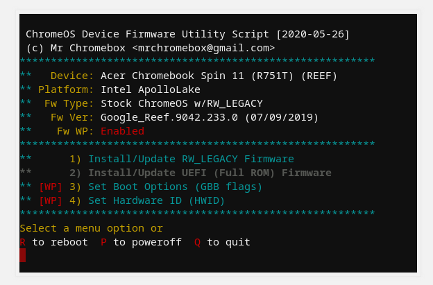

## Chromebook Hacking

I was back home at my parents one weekend in January and my dad had cleaned out his closet *(which used to be my old closet)*. He found a whole bunch of my old laptops. Four out of the five were massive pieces of junk all from Toshbia. **Do they even make laptops anymore?**

Anyway the only one that was semi-modern and salvagable was my old Chromebook which was the laptop I started "programming" on. Really just struggling through Codeacademy. When I first started programming I realized that ChromeOS was really locked down. I didn't know how to bypassall the restrictions they come with out of the box so when I tried to get more control over my development environment I just went and got aMacbook instead. FF 6 years and since I think I'm a little more advanced now and I began to dabble in using different flavors of Linux, I figured I could turn that Chromebook into a portable Linux machine to tinker with. How hard could it be?

This is going to be a short post that just details what I needed to do in order to remove ChromeOS from the machine. I might do a separate post on installing Arch but there is a whole ass installation guide that I essentially just followed and then debugged my way through so I don't think I'll do one on that. 

### Day 1 

I arrive home full of glee. Thinking that I'll just quickly be able to burn an ISO, remove ChromeOS and start tinkering. I was going to roll Ubuntu Cinnamon but I realized that was going to take up more memory than Ihad available in machine so I figured I'd install Arch from scratch so I could use the meme and I read that its footprint was small to start but could be fully customized. 

Gotta find the name of your USB stick so you can write to first. I just used this command to list out all the block devices attached to my machine. Blockdevices are just things that transfer a group of bytes at a time. Like your HDD, SSD, or your USB stick 
```bash
lsblk
```

I burn the ISO onto a USB stick using the [dd](https://ss64.com/bash/dd.html) core utility. If you don't wanna read that link its a utility whose primary pupose is to copy a file and then optionally convert it during the copy process.

```bash
dd bs=4M if=/home/root/Download/someiso.iso of=/dev/dist/sda conv=fsync oflag=direct status=progress
```
+ **bs** -> Block size, both rw number of bytes at a time. 
+ **if** -> Input file
+ **of** -> Output file
+ **conv** -> Conversion format. Arch Linux doc had fsync; but the dd man page doesn't saying about fsync. 
+ **oflag** -> 'direct' because we don't want to add anything extra to output data
+ **status** -> Shows the status of the data transfer. Without this you won't see anything.

After I burned the ISO file. I went into research mode figuring out how I could wipe this Chromebook when I came across our first hero: [MrChromebox.tech](https://mrchromebox.tech/#fwscript). This stud knows all about rolling different OS' on Chromebooks and created a centralized location for all the resources you'll need to mess around with your Chromebook. 

From there I was able to figure out how to boot into [developer mode](https://mrchromebox.tech/#devmode). Which is the first step needed since the regular boot mode will lock you out of the shell that we need. I'm not going to go into firmware too heavily but if you are interested there is a cool section [All About Firmware](https://mrchromebox.tech/#firmware) that talks about the firmware used to create ChromeOS. 

After booting into developer mode there are two ways to get a root capable shell: 

1. CTRL - ALT - F2 (Right Arrow on ChromeOS keyboards). Then you can login with the user 'chronos'
2. CTRL - ALT - T (but only with a browser window open). Then type ```shell``` and press Enter

*I needed to do #1 since because from a certain model of Chrome forward we can't run the utility script that I'm going to tall about next.*

At this point you can do whatever it is you came here to do. For me I was going to flash the firmware which would remove ChromeOS and make the machine like any regular run of the mill laptop. 

How does one do that you ask? Beats me lol. However, Mrchromebox swoops in again with a [Firmware utility script](https://mrchromebox.tech/#fwscript). This script simplifies the common functions most users needed when interfacting with the firmware on a ChromeOS device. To run the script here was the comand from the docs and for my machine I needed to run the script from #1 above since there they parched begin able to run it from the crosh shell which is option #2 above. It was late at night and I was ready to keep this moving so I followed the command in the ```chronos``` shell

```bash
cd; curl -LO mrchromebox.tech/firmware-util.sh && sudo bash firmware-util.sh
```

I didn't encounter any issues with the script and I landed here after executing the command in my elevated terminal. 

I was going for **2)** in the screenshot. I wanted to do a do a full replacement of the firmware and then boot directly into UEFI mode which would make my PC "regular" which means no more ChromeOS. Sweet right? 

EXCEPT when I tried to select the second option I was getting error messages telling me that WP was enabled still and that I needed to disable it before I could turn fully update the firmware. 

Naturally I started googling and then found I could disbale the WP *most likely* in one of two ways. Either crack open this bad boy and mess with the battery or if my model supported it I could do something called CCD (Closed Case Debugging). 

It was already running later and I did not feel like splitting this mfer open so I looked more into CCD. Using yet another Mrchomebox link I found my model here under [Supported Devices](https://mrchromebox.tech/#devices):SNAPPY, so an HP Chromebook. The WP or Write Protect method is confirmed on my batter.Clicking on the CR50 link on that page brought me to Mrchromebox wiki that dives into [how firmware write protect works](https://wiki.mrchromebox.tech/Firmware_Write_Protect#Hardware_Write_Protection). 

Coming to the bottom of this guide I saw that I needed a special cable called a Suzy Q cable. Which when I googled it, looked exactly like a regular USB-A-> USB connector. I figured I'd give it a go with a regular cable that I used to charge my keyboard; no luck and I wasted about 20 mins trying that twice before I the ole dusty Google trail and found a Reddit post saying that even though it looked exactly like a run of the mill USB A -> USB C connector, thepins underneath the USB C port were different and on top ofthat you couldn't buy them online from the usualy Suzy Q plug since they stopped making them for whatever reason. Bummer. I shut off my office machine and headed to my kitchen for some buttered Biscoff toast as I was mulling over my options:

+ Roll my own Cable? 
  + Someone posted the schematics but I had no idea where tf to start with that and it would be a huge timesuck
+ Let it collect dust in my office forever. 

### Day 2


